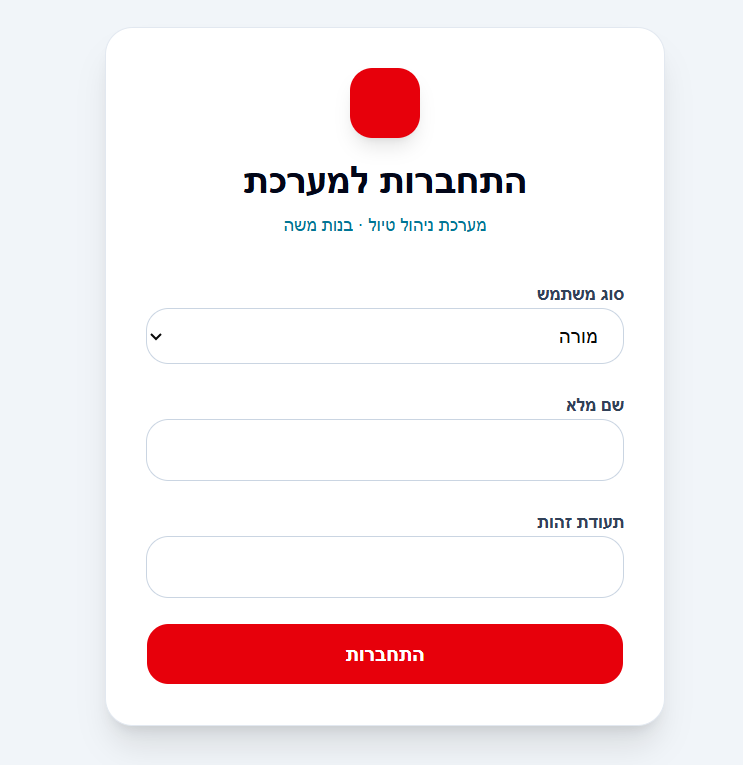
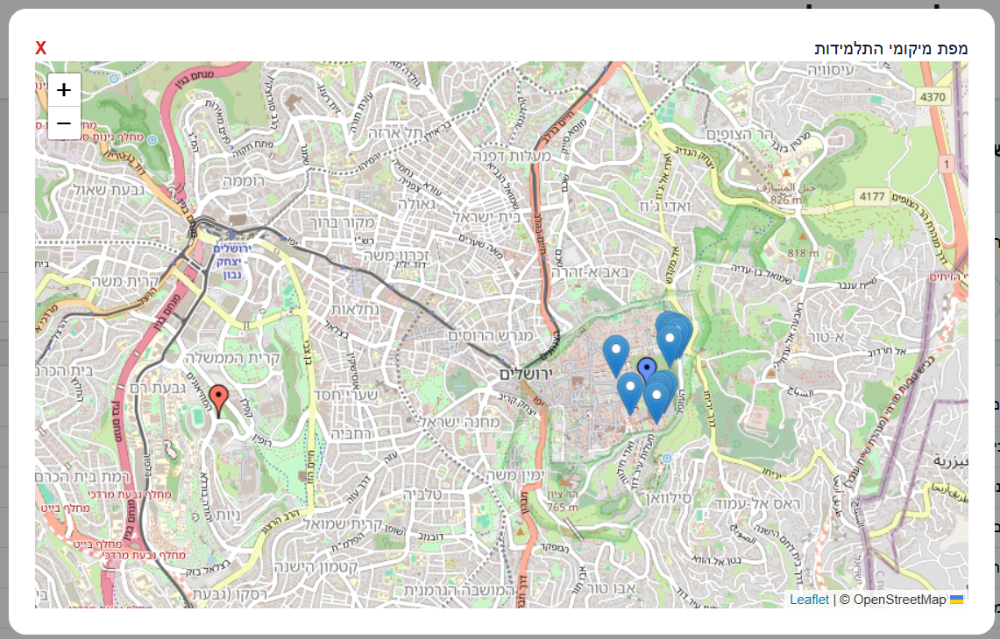

# מערכת ניהול מורות ותלמידות + מעקב מיקומים

## תיאור הפרויקט
מערכת Full Stack לניהול מורות ותלמידות הכוללת:
- ניהול משתמשים (מנהל / מורה)
- חיפוש וסינון
- הרשאות
- הצגת מיקומים על מפה
- זיהוי תלמידות רחוקות מהמורה

---

## מבנה הפרויקט

- [Client - צד לקוח](./client/README.md)
- [Server - צד שרת](./server/README.md)

---

## טכנולוגיות

- Node.js + Express
- MongoDB (Mongoose)
- React + TypeScript
- Tailwind CSS + shadcn/ui
- Leaflet (מפות)

---

## הרצה מהירה

```bash
# server
cd server
npm install
npm run dev

# client
cd client
npm install
npm run dev

```
## Screenshots

### Login


### Dashboard


### Map
